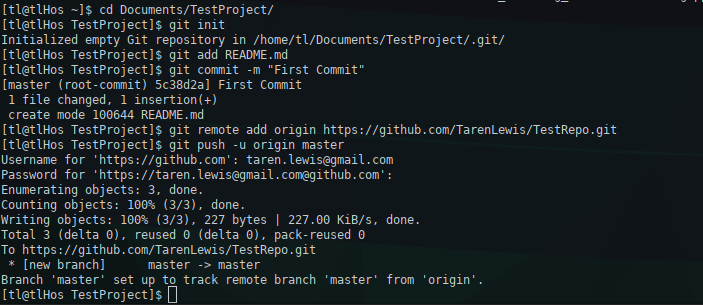

# Your first commit

### After creating the new remote repository, if you are creating a new local repository,  open git and use the Command Line Interface to navigate to the directory of the files which you want to put into the remote repository on Github. You can make a simple text doc in the directory to illustrage how commits work. Lets assume you have a README.md in the directory.   Type:

>***git init***
> (this initializes a .git folder and git files in the current directory)  
>***git add README.md***
> (this adds the README.md document we put in the directory to the git staging >area. It tells Git that you want to include this file in the next commit.)  
>***git commit -m "First Commit"***
> (***-m*** means message, and the message is located between the two quotation marks)  
>***git remote add origin https://github.com/YourGithubUsernameHere/YourRepoNameHere.git***
> (this adds the remote origin for your local files and local git directory)  
>***git push -u origin master***
> (this pushes your local changes to the remote repository located on github.com)  

Now you can go to your repository on Github and see your README.md located in your remote repository! You can see an example below:

---

### If you want to ***push an existing repository*** from the command line, type the last two previously listed commands:

>***git remote add origin https://github.com/YourGithubUsernameHere/YourRepoNameHere.git***  
>***git push -u origin master***
