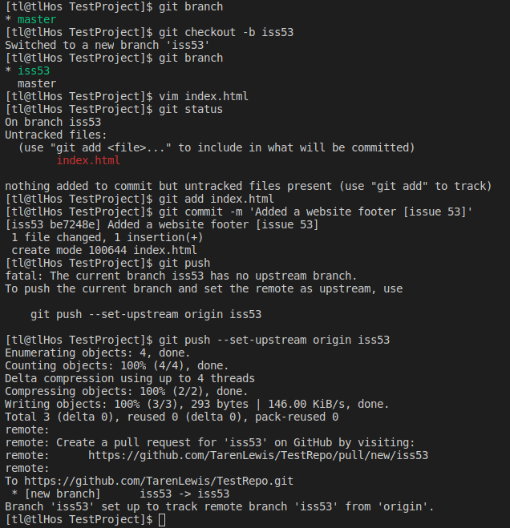
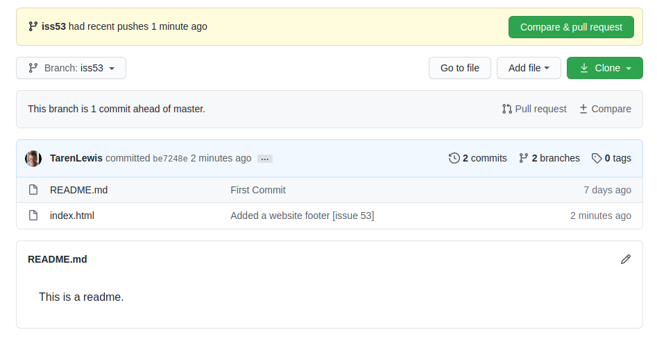

# Basic Branching

### Now that you are familiar with making a commit in the master branch, we will simulate the creation of a new branch to add a new feature to our code base, and start working in that branch. 

Lets say we have already committed 3 times in our Master branch, our git history will look like this:
 
(C0 is commit 0, C1 is commit 1, etc.)  

 Now we are going to create a new branch to add a feature. We will be adding some code to include a footer in a website we are building. We will call this "issue53". To create the new branch _(which is branching off from the Master branch)_ and switch to it at the same time we will do the following.
Type:

>***git checkout -b iss53***
> (this creates and checks out a new branch called 'iss53' for issue #53.)

 Alternatively, you could type:
>***git branch iss53***
> (this creates the new branch called 'iss53') 
>***git checkout iss53***
> (this checks out that branch, aka switches to that branch) 

  
At this point, we now have 2 branches: **Master**, and **iss53**. They are located at the same commit, C2: 

  
You can start to make changes to your code on the **iss53** branch, and as soon as you make a change to this code, this will move the branch ahead of the **Master** branch, which will look like this: 

  
Now that we have made changes to our code within the **iss53** branch (I just added a small change to an index.html file), we need to commit these changes. 
Type: 

>***git add index.html***
> (I typed 'index.html', but you will need to type whatever the name of the file is that you have changed.)
> ***git commit -m 'Added a website footer [issue 53]'***
> (this adds the commit message about the website footer that we have added) 

  
The final thing we need to do is tell git what the upstream branch of branch **iss53** is. The upstream branch defines the branch tracked on the remote repository, by your local branch. This will be on the remote repository we built on Github. We will then push our changes to the remote **iss53** branch and look on Github to view our changes. 
Type:

>***git push --set-upstream origin iss53***
> (this sets the upstream branch to origin and pushes to the remote repository)
  
---

  
## Here is an example of the process in action, with a couple extra commands to show the status of what is happening. 

  
## And here is what it looks like when you have changes committed in your remote branch on Github: 
